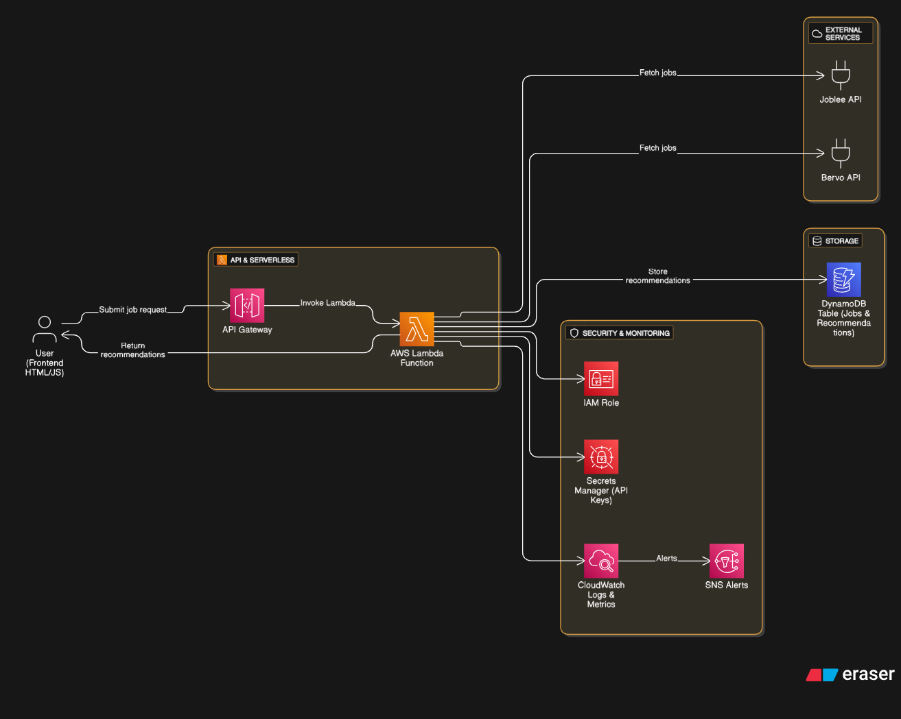

# 🔍 Serverless Job Recommendation System (AWS Lambda + API Gateway + DynamoDB)

This project is a **fully serverless** job-recommendation workflow built using  
**AWS Lambda**, **API Gateway**, **DynamoDB**, and external APIs (Joblee + Bervo Email API).  
Users submit a job title through a simple web UI → Lambda fetches matching job links → emails the results → stores the user request in DynamoDB.

Everything runs without servers, cron jobs, or manual triggers.

---

## 🚀 What This System Does (Simple Explanation)

1. User fills a form (name, email, job role) in HTML UI  
2. **API Gateway → Lambda** triggers instantly  
3. Lambda performs 3 tasks:
   - 🔎 Fetch job recommendations using **Joblee API**  
   - ✉️ Send an email with job links using **Bervo API**  
   - 🗃️ Store user request & API results in **DynamoDB**  
4. User receives the recommended job links **within seconds**

This is exactly how modern serverless applications work in the real world.

---

## 📌 Why I Built This

To learn real industry skills:
- Serverless architecture  
- Event-driven Lambda functions  
- API Gateway integration  
- External API calls inside Lambda  
- DynamoDB CRUD workflows  
- HTML → JS → API Gateway → Lambda pipeline  

This project shows full-stack + backend data engineering skills.

---

## 🏗 Architecture



**Flow:**  
HTML UI → JavaScript → API Gateway → Lambda → Joblee/Bervo APIs → DynamoDB → Email to User

---

## 📁 Repository Structure

```

Serverless-Job-Recommendation/
│
├── index.html              # Frontend form page
├── success.html            # Success confirmation page
├── script(1).js            # Sends frontend data to API Gateway
├── style.css               # UI styling
├── ui.css                  # Additional styling
│
├── lambda.py               # Main Lambda function (3 actions)
├── inster.py               # DynamoDB insert logic (older version)
├── py.py                   # Utility/helper script
│
├── job recommendation.png  # Architecture diagram
└── README.md

````

---

# 🔧 Technologies Used

### **AWS Services**
- **API Gateway** → REST API trigger  
- **Lambda** → business logic  
- **DynamoDB** → NoSQL storage  
- **IAM** → security + permissions  

### **Frontend**
- HTML  
- CSS  
- JavaScript (fetch API → POST request)

### **External Services**
- **Joblee API** → fetch job recommendations  
- **Bervo Email API** → email delivery  

---

# ⚙️ Step-by-Step Implementation (How I Built It)

---

## **1️⃣ Frontend (HTML + CSS + JS)**

- Built UI using `index.html`, `style.css`, `ui.css`
- Form collects:
  - User name  
  - Email  
  - Desired job role  

JavaScript (`script(1).js`) sends a **POST request** to API Gateway:

```javascript
fetch("https://<api-id>.execute-api.<region>.amazonaws.com/prod/recommend", {
    method: "POST",
    body: JSON.stringify({
        name: userName,
        email: userEmail,
        job: jobTitle
    })
})
````

---

## **2️⃣ API Gateway (REST API)**

Set up routes:

| Method | Path       | Purpose                        |
| ------ | ---------- | ------------------------------ |
| POST   | /recommend | Trigger Lambda (main function) |

Enable:

* CORS
* Proxy integration
* Lambda trigger permission

---

## **3️⃣ Lambda Function (Main Logic)**

`lambda.py` performs 3 major tasks:

### **1. Fetch Job Links (Joblee API)**

Lambda hits Joblee endpoint:

```python
response = requests.get(f"https://joblee-api/jobs?title={job_title}")
```

Extracts the top job recommendations.

---

### **2. Send Email with Recommendations (Bervo API)**

```python
email_data = {
  "to": user_email,
  "subject": "Your Job Recommendations",
  "message": recommended_jobs
}
requests.post("https://api.bervo-mail/send", json=email_data)
```

---

### **3. Store User Request in DynamoDB**

```python
dynamodb.put_item(
    TableName="JobRecommendationTable",
    Item={
        "email": {"S": email},
        "job_title": {"S": job_title},
        "timestamp": {"S": str(datetime.utcnow())}
    }
)
```

---

## **4️⃣ DynamoDB Table**

Sample schema:

| Partition Key  | Attribute                   |
| -------------- | --------------------------- |
| email (String) | job_title, links, timestamp |

Stores user request + recommended job data.

---

## **5️⃣ End-to-End Flow Result**

✔ User submits job role
✔ Lambda fetches matching jobs
✔ Email sent within seconds
✔ Entry added to DynamoDB
✔ UI redirects to success page

---

# 💡 Key Skills Demonstrated

* Event-driven **serverless architecture**
* Secure **API Gateway → Lambda** integration
* Working with **REST APIs inside Lambda**
* DynamoDB NoSQL storage design
* Full-stack workflow from UI → backend → database → email
* AWS IAM roles + permissions
* Clean, modular Lambda code with clear responsibilities

This is the type of system used for notification workflows, automation, and microservices.

---

# 🧪 How to Test

1. Open `index.html` in browser
2. Enter job role + user details
3. Submit → hits API Gateway
4. Verify:

   * Email is received
   * DynamoDB item is created
   * Lambda logs show success

---

# 📄 Resume Bullet Points

* Built a serverless job recommendation system using **AWS Lambda, API Gateway, DynamoDB**, and external APIs for job search and email automation.
* Designed backend logic to fetch job recommendations, deliver emails within seconds, and store user interaction history in DynamoDB.
* Integrated frontend HTML/JS with AWS API Gateway for seamless user-driven serverless execution.

---

# 👤 Author

**Gnana Prakash N**
Aspiring Data Engineer
GitHub: [gnanaprakashn](https://github.com/gnanaprakashn)

---

# 📜 License

MIT © 2025
